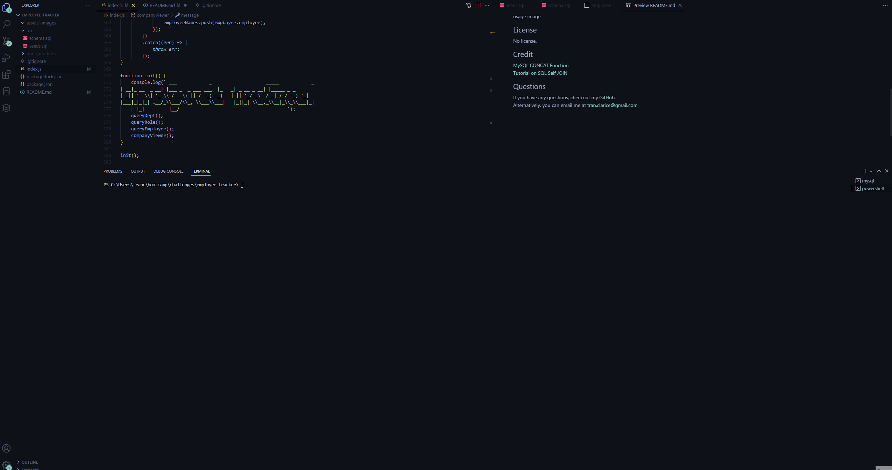

# Employee Tracker

## Description

This is a command-line application enables a user to create a company database to store, view and modify information about their company's employees, roles, and departments. The user is able to create departments, roles, and employees. Additionally, the user may modify employee data.

With this application, I was able to practice creating, viewing, and modifying a database with MySQL and Node.js.

## Table of Contents

-   [Installation](#installation)
-   [Usage](#usage)
-   [Credits](#credits)
-   [License](#license)
-   [Questions](#questions)

## Installation

1. Clone this repository
2. Open this repository in VSCode
3. Open the integrated terminal for the repository
4. Run npm install
5. Before proceeding to step 6, be sure you have MySQL installed properly by following this [guide](https://coding-boot-camp.github.io/full-stack/mysql/mysql-installation-guide).
6. Once you've confirmed MySQL is installed, open an additional integrated terminal in the db folder.
7. Run `mysql -u root -p`.
8. Run `SOURCE schema.sql` to create the database.
9. Run `SOURCE seeds.sql` to input information into the tables of the database.
10. Now the script is ready to run.

## Usage

In the console for the repository, run `node index.js`. This will initiate the application and the user is greeted with a menu. Selecting the options will either return a table based on what was selected, or a series of prompts will be asked for the user to add or modify data in the database.

## License

No license.

## Credits

[MySQL CONCAT Function](https://www.w3schools.com/sql/func_mysql_concat.asp) 
[Tutorial on SQL Self JOIN](https://learnsql.com/blog/illustrated-guide-sql-self-join/)

## Questions

If you have any questions, checkout my [GitHub](https://github.com/claricetran).  
Alternatively, you can email me at <tran.clarice@gmail.com>
